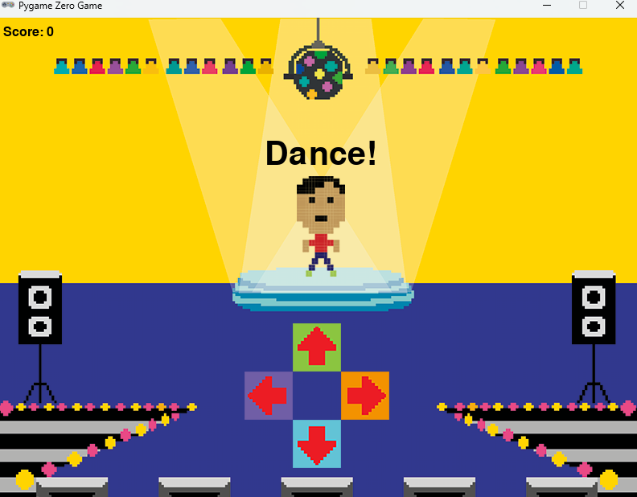

# Dance Game

 In this game, you'll need to match the computer-generated dance moves to score points. The game gives you a sequence of moves to perform, and you must press the corresponding arrow keys in time with the sequence.

## Table of Contents

---

## How to Play

1. **Game Objective**: The game will display a series of dance moves (represented by arrows). Your goal is to press the correct arrow keys in order (Up, Right, Down, Left) after the sequence completes.
2. **Scoring**: Each time you successfully press the correct key, you earn a point. Incorrect moves will end the game, and your final score will be displayed.
3. **Starting the Game**: The game begins by displaying a countdown and the dance moves you need to follow. After completing a sequence, a new set of moves will be generated.
4. **Winning**: There is no defined winning condition—just keep playing and try to score as high as possible!

---

## Requirements

Before you can run the game, you'll need to have Python and the `pgzrun` library installed.

### Python

* Python 3.x

### Dependencies

* **pgzrun**: The library that runs the game.

You can install the required library using:

```bash
pip install pgzrun
```

---

## Installation

1. **Clone the Repository**:

   ```bash
   git clone https://github.com/Johnmcginnes168/Dancing-Game.git
   ```

2. **Navigate to the Game Folder**:

   ```bash
   cd dance-match-game
   ```

3. **Run the Game**:

   Once everything is set up, you can run the game with the following command:

   ```bash
   python dance.py
   ```

---

## Controls

* **Up Arrow**: Press to perform the "Up" move.
* **Right Arrow**: Press to perform the "Right" move.
* **Down Arrow**: Press to perform the "Down" move.
* **Left Arrow**: Press to perform the "Left" move.

Make sure to press the correct key at the right time to match the move and score points.

---

## Game Screenshot



---

## Credits

* **Game Developer**: John McGinnes

---
